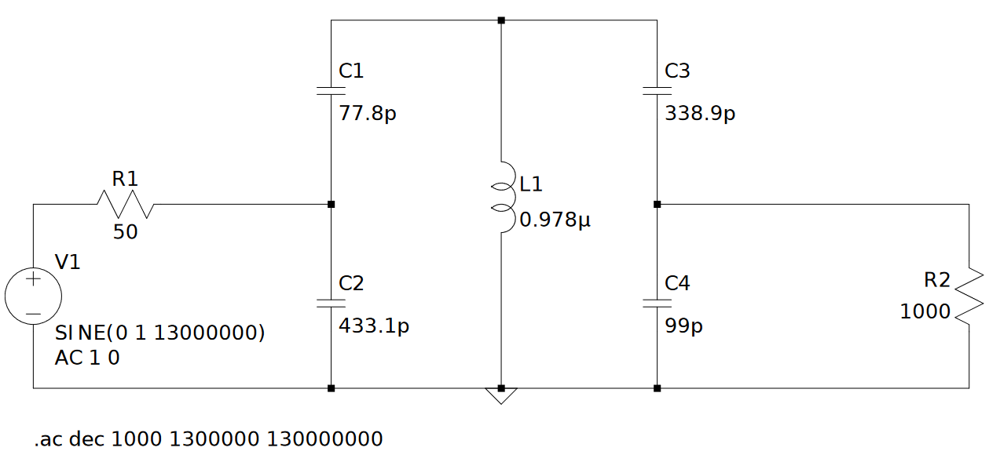
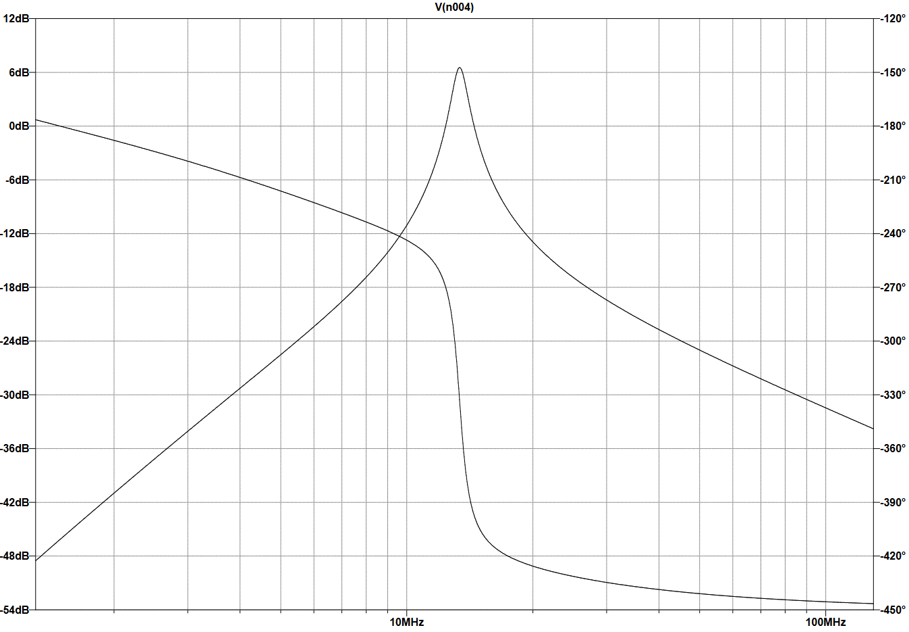
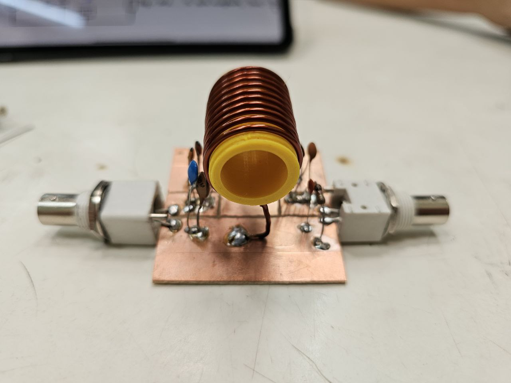
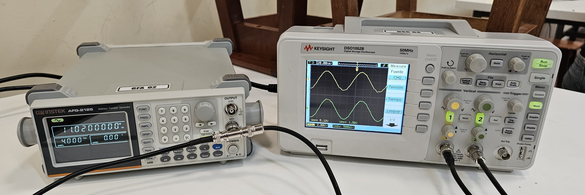

# Trabajo Práctico N°1: Circuito Sintonizado Simple

## Consigna

Diseñar y construir un circuito doble sintonizado como el explicado con las siguientes especificaciones:

- $f_o = 13 \ MHz$
- $BW = 1.3 MHz$
- $Q_c = 10$
- $Z_L = 1000 \Omega$
- $Z_i = 50 \Omega$

## Simulaciones

### Respuesta en frecuencia

De la simulación se obtiene el siguiente diagrama de Bode, que representa la respuesta en frecuencia de la tensión de salida.

### Impedancia de entrada

Para ver la impedancia de entrada, se mide la salida cargada y luego descargada. Se mide lo siguiente:

- Tensión del generador descargado: $1 \ V$
- Tensión del generador cargado: $540 \ mV$

De esa forma, se obtiene:

$$
Z_{in} = 58.69 \Omega
$$

### Impedancia de salida

Similar a la medición anterior, pero se mide ahora sobre la salida cargada y descargada, de esa forma se obtiene:

- Tensión de la salida descargada: $3.268 \ V$
- Tensión de la salida cargada: $1.8 \ V$

De esa forma, se obtiene:

$$
Z_{out} = 815.56 \Omega
$$

### Ancho de banda

Se mide mediante los cursores que el ancho de banda es de aproximadamente $1.11 \ MHz$.

A partir del dato del ancho de banda, se obtiene un valor de $Q_c = 12.01$.

## Construcción real

Se obtuvo el siguiente circuito prototipo.

## Resultados de mediciones 

Las mediciones fueron realizadas en el pañol de la facultad, junto con los instrumentos:

- Generador de funciones GW Instek AFG-2125 (código GFA02).
- Osciloscopio Keysight DSO1052B (código OSC64).

Se muestra en la siguiente tabla el resultado de las mediciones realizadas sobre el dispositivo, así como las discrepancias con respecto al diseño planteado en la consigna.

| Magnitud | Valor de diseño | Valor obtenido | Variación |
|----------|-----------------|----------------|-----------|
| $R_p$     | $37324,55\Omega$ | $4202,42\Omega$ | $-88.74 \%$ |
| $L$      | $0,978\mu Hy$   | $0,991\mu Hy$  | $+1.33 \%$  |
| $f_o$     | $13M Hz$        | $13,44M Hz$    | $+3.38 \%$  |
| $Z_{in}$ | $50\Omega$      | $29,64\Omega$  | $-40.72 \%$ |
| $Z_{out}$| $1000\Omega$    | $1047,62\Omega$| $+4.76 \%$  |
| $BW$     | $1,3M Hz$       | $1,03M Hz$     | $-20.77 \%$ |
| $Q_c$    | $10$            | $12,9$         | $+29 \%$    |
| $Q_d$    | $467,14$        | $74,34$        | $-84.09 \%$ |

## Conclusiones

Pudo completarse un trabajo práctico que consta de un circuito resonador a una determinada frecuencia. Sin embargo, los parámetros del sistema real difieren en cierta medida de lo obtenido mediante cálculos.

La parte considerada más complicada fue el bobinado del inductor, tarea que se torna dificil si no se cuenta con elementos apropiados para realizarla. Más allá de eso, no existieron otros inconvenientes. Se destaca la gran utilidad del carretel roscado impreso en 3D para poder mantener la separación uniforme entre espiras planteada en el diseño del inductor. Pudo comprobarse que el carretel hueco no afecta al valor de la inductancia, sin embargo, con los dispositivos de medición utilizado es muy dificil encontrar una variación de la frecuencia de resonancia, algo que evidentemente ocurre en la realidad, ya que la permeabilidad del plástico PLA no es la misma que la del aire. El agregado del carretel hueco hace que, en aproximadamente la misma frecuencia de resonancia, el valor de la tensión pico aumente con respecto a la situación en dónde éste no esté colocado. Esto se debe a que la resistencia de pérdidas del inductor aumenta con este agregado (probablemente porque la distancia entre espiras se mantiene constante, pudiendo tener un flujo magnético más uniforme), logrando que en el divisor resistivo (situación a la que se llega por la resonancia del circuito) aumente la caída de tensión en ese resistor.

La impedancia de entrada mostró una variación de 40% con respecto a la original solicitada, esto puede deberse a dos factores principales:
- Capacitancia parásita del osciloscopio: esta capacidad (como pudo medirse) tiene un valor comparable al resto de los capacitores utilizados, lo que termina afectando al circuito. Esta modificación que termina implicando el osciloscopio en el circuito real termina afectando las relaciones obtenidas como reflexiones de impedancia, no logrando la impedancia deseada en un principio.
- Resistencia de pérdidas distinta a la calculada: este valor difiere mucho del calculado para el diseño, lo que implica que la resistencia total del circuito termina variando, y por ese hecho se tiene un circuito muy diferente al simulado. 

Una manera de acercar el circuito un poco más al ideal calculado, eliminando la capacitancia parásita del osciloscopio es con un medidor de relación de onda estacionaria (ROE). 

Las magnitudes de: impedancia de salida e inductancia (y, por ende, de frecuencia de resonancia) no se vieron muy afectadas con respecto a los parámetros de cálculo, esto puede deberse a la gran precisión con que está hecho el inductor, así como al valor casi redondo (con respecto al calculado) de los capacitores que reflejan la impedancia de salida.

El ancho de banda se vio modificado, esto por el hecho de que el factor de calidad descargado de la bobina no es exactamente el mismo que se pidió para el diseño. Como este factor depende directamente de la resistencia total e inversamente de la reactancia inductiva, puede entenderse que éste debería disminuir, ya que la resistencia total disminuye a causa de la gran reducción del valor de la resistencia de pérdidas del inductor. Este nuevo valor de Rp, ahora que resulta comparable a las demás resistencias que están en paralelo, hace que la resistencia resultante termine disminuyendo. Si disminuye la Rt, entonces también lo hace Qc en la misma medida, y, al darse esto, el ancho de banda debería aumentar, sin embargo, en la práctica ocurre el efecto totalmente contrario. Ocurre lo contrario porque las pérdidas no son extremadamente altas en la bobina, así que, para poder cumplir con el factor de calidad solicitado, y aumentar el ancho de banda, la solución más sencilla sería colocar un resistor en paralelo, de modo de disminuir aún más el valor de Qc, y por ende aumentar el ancho de banda.

En cuanto al factor de calidad descargado, puede verse una gran variación, que, a priori se puede predecir, ya que existió una gran diferencia entre el valor de la resistencia de pérdidas paralela del inductor real con respecto a la ideal. Esta variación de resistencia seguramente viene debida a cuestiones constructivas, así como de composición del material con el que se construyó el inductor, es algo sobre lo que no se tiene completo control.

De la tabla 2, puede hacerse un resumen de características que pasan o no el examen, a modo de resumir el trabajo realizado. Se tiene:
- Resistencia de pérdidas: falla
- Inductancia: aprobada
- Frecuencia de resonancia: aprobada
- Impedancia de entrada: falla
- Impedancia de salida: aprobada marginal
- Ancho de banda: aprobado marginal
- Factor de calidad cargado: aprobado marginal
- Factor de calidad descargado: falla

